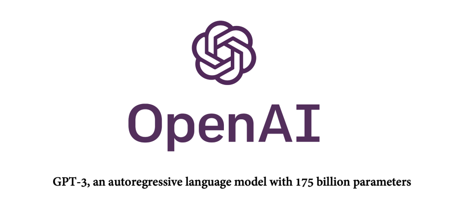

<p align="center">
  
</p>

> 👨‍🚀 **Repo for the purpose of personal study**

<p align="center">
  

  

  
</p>

# ⚔️ Proposed Challenge

Create a api integration with openIA text completion  **(ChatGPT)** with Node.


```
# Routes
POST     /api/prompt      sending prompt to text completion

```

# 🚀 Technologies

This code source was developed with the following technologies:

### ⚛️ Main Techs

- [Node.js](https://nodejs.org/en/)
- [Javascript](https://developer.mozilla.org/en-US/docs/Web/JavaScript)

### 📚 Libs & Dependencys

- [openAI](https://npmjs.com/package/openai) - To integrate with openAI Algorhitms
- [express](https://.npmjs.com/package/express) - For create rest apis with more
- [cors](https://.npmjs.com/package/cors) - Control access to api requests/resources
- [dotenv](https://.npmjs.com/package/dotenv) - Configuration custom file
- [nodemon](https://.npmjs.com/package/nodemon) - Node monitoring server for development

### 🥷 Techniques

- [N-Tier Architecture](https://www.baeldung.com/cs/n-tier-architecture)

## :information_source: How To Use

To clone and run this application, you'll need [Git](https://git-scm.com), [Node.js v14.16](https://nodejs.org/en/) or higher + [NPM v8](https://nodejs.org/en/) or higher installed on your computer. From your command line:

```bash
# Clone this repository
$ git clone https://github.com/felipeAguiarCode/node-chatgpt-api

# Go into the repository
$ cd node-chatgpt-api

# Install dependencies
$ npm install

# Run (development ambient)
$ npm run dev
```
* to use openai lib
```bash
The library needs to be configured with your account's secret key, which is available on the website. Setting API key as an environment variable in .env. before run
```
